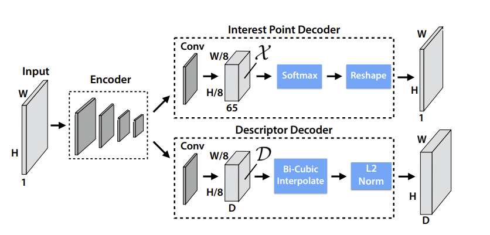

# Deep Learning-Based Interest Point Detector

## Overview

In this assignment, you will develop and train a deep learning-based neural network to detect interest points in images.

Many state-of-the-art models, such as:

- [SuperPoint](https://arxiv.org/abs/1712.07629)
- [SiLK](https://arxiv.org/abs/2304.06194)

utilize an encoder-decoder architecture similar to the one depicted below:



The **encoder** (or backbone) generates feature maps that the **decoder** (or keypoint head) uses to identify keypoints, which are fundamental to various computer vision applications.

### Task Description

Your task is to use a **pre-existing model** as the backbone (e.g., [MobileNetV4](https://arxiv.org/abs/2404.10518)) and modify it by appending a **keypoint regression head**.

To facilitate training and evaluation, we provide:
- A script to generate a **synthetic training dataset** [(details here)](#training-dataset).
- An **evaluation script** that tests the model on a real dataset [(details here)](#evaluation-protocol).

### Useful Resources

- [Torchvision Models](https://pytorch.org/vision/0.9/models.html)
- [Using Pretrained Models as Feature Extractors](https://huggingface.co/docs/timm/feature_extraction)

## Deliverables

Your submission should include:
- A **1–2 page technical report** summarizing your methodology and results.
- A **GitHub repository** containing:
  - Code with clear instructions for reproducing results.
  - Alternatively, a compressed archive of the code may be emailed to 
    - **francesco.vultaggio@ait.ac.at**
    - **phillipp.fanta-jende@ait.ac.at**

### Time Estimate
- **Expected Completion Time:** ~8–10 hours, **do not exceed this time**. 
- **Submission Deadline:** **Monday, March 10, 2025**

## Training Dataset

The dataset comprises synthetic images with corresponding interest point pixel labels.

A dataset generation script is provided: [synth_dataset.py](synth_dataset.py).

For real-time dataset generation during training, refer to: [dummy_train.py](dummy_train.py).

## Evaluation Protocol

Your model’s performance will be assessed based on the **repeatability** of its detected keypoints using the [HPatches dataset](https://www.kaggle.com/datasets/javidtheimmortal/hpatches-sequence-release?resource=download-directory).

### Evaluation Steps:
1. **Download and extract** the HPatches dataset into the `evaluation/HPatches` directory.
2. Extract keypoints from the dataset. For example, to use the [FAST](https://docs.opencv.org/3.4/df/d0c/tutorial_py_fast.html) corner detector, refer to [extract_fast.py](examples/extract_fast.py).
3. Run the evaluation using [eval_detector.py](evaluation/eval_detector.py).

## Installation Instructions

To set up a **Conda environment** with PyTorch and all necessary dependencies, follow these steps:

### Step 1: Install Miniconda or Anaconda

If not installed, download and install either:
- [Miniconda](https://docs.conda.io/en/latest/miniconda.html)
- [Anaconda](https://www.anaconda.com/products/distribution)

### Step 2: Create and Activate the Conda Environment

Run the following commands in a terminal:

```bash
conda create -n ait_test python=3.10
conda activate ait_test
pip install -r requirements.txt
```

This creates a Python 3.10 environment named `ait_test` and installs all required dependencies from `requirements.txt`.

## Acknowledgements

Special thanks to [SuperPoint](https://github.com/rpautrat/SuperPoint) for providing dataset generation code.

